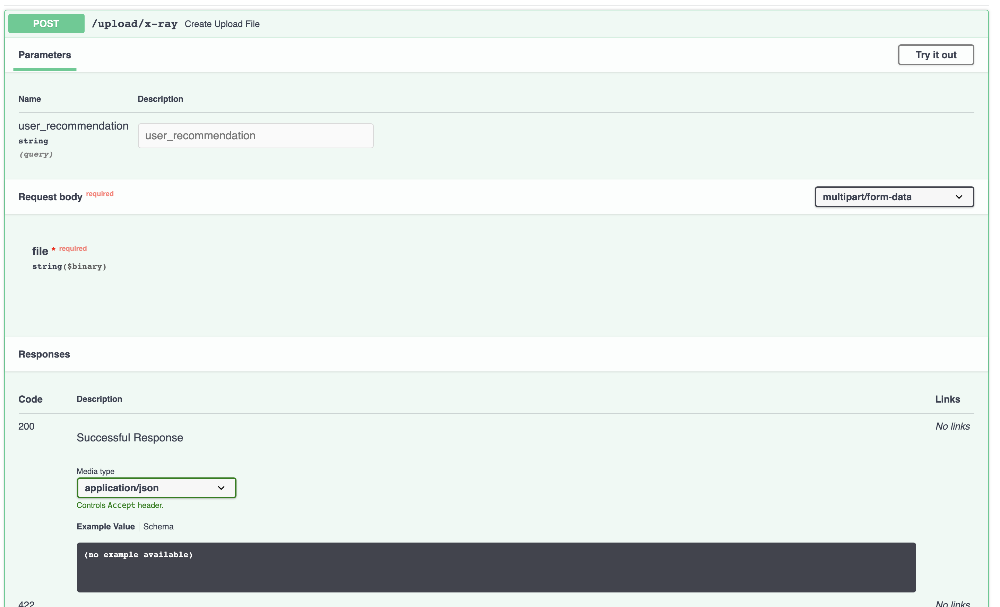

# covid19-detection
Detection of Covid-19 from X-ray images

## Status:
- TEST Accuracy : 90%
- Model used in web : model_keras_215.hdf5

[](http://0.0.0.0:8000/github/stats/cas.svg)


## Train
``` shell script
python3 TRAIN.py -d dataset/test -m model_name.hdf5
```
**NOTE** :
- Model with `model_name.hdf5` will save in SavedModel directory.
- `ep` variable in TRAIN.py file is epoch count. you can change it.

example:
```shell script
python3 TRAIN.py -d dataset/test -m amin.hdf5
```
result:


## Test 
### test 10 random image
``` shell script
python3 test_model_10_images.py -d dataset/validation -m model_name.hdf5
```
load and show 10 labeled samples

example:


### test single image

```shell script
python3 test_model_1_image.py -i path_to_image  -m path_to_model

```
example:
```shell script
python3 test_model_1_image.py -i ./dataset/one/covid/Chest.jpeg  -m ./SavedModel/amin.hdf5
```

## API ( WIP )
for gathering more images and make the dataset better, I create e simple API for upload the X-RAY image like below examples:


The uploaded image will validate after upload and the server return label of the image.
Label my be incorrect. (because of the low count of images in the dataset).

